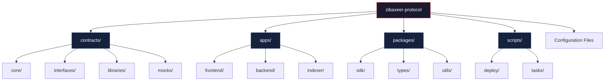
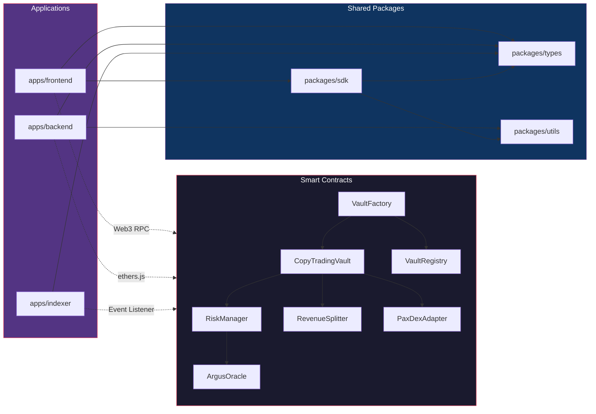

# ZibaXeer — File Structure

Complete directory layout for the ZibaXeer on-chain copy-trading vault protocol.

---

## Project Structure Overview



---

## Full Directory Tree

```
zibaxeer-protocol/
|
|-- contracts/                        # Solidity smart contracts (Foundry project)
|   |-- src/
|   |   |-- core/
|   |   |   |-- VaultFactory.sol              # Deploys and registers new copy-trading vaults
|   |   |   |-- CopyTradingVault.sol          # Core vault logic: trades, mirroring, PnL
|   |   |   |-- RiskManager.sol               # Risk parameter validation and circuit breakers
|   |   |   |-- RevenueSplitter.sol            # Profit calculation and automated distribution
|   |   |   |-- VaultRegistry.sol              # On-chain vault directory and metadata store
|   |   |
|   |   |-- oracle/
|   |   |   |-- ArgusOracle.sol               # Bridge to Argus Risk Engine for reputation data
|   |   |   |-- PriceOracle.sol               # Price feed aggregator for PaxDex pairs
|   |   |
|   |   |-- adapters/
|   |   |   |-- PaxDexAdapter.sol             # Interface adapter for PaxDex swap routing
|   |   |   |-- PaxDexLiquidityAdapter.sol    # Adapter for LP interactions
|   |   |
|   |   |-- governance/
|   |   |   |-- ZibaXeerToken.sol             # Protocol governance and utility token (ERC-20)
|   |   |   |-- ZibaXeerGovernor.sol          # DAO governance contract (OpenZeppelin Governor)
|   |   |   |-- TimelockController.sol        # Timelock for governance proposals
|   |   |
|   |   |-- libraries/
|   |   |   |-- MathLib.sol                   # Fixed-point math and PnL calculations
|   |   |   |-- TradeLib.sol                  # Trade encoding, decoding, and validation
|   |   |   |-- RiskLib.sol                   # Risk metric calculations (drawdown, Sharpe)
|   |   |   |-- PercentageLib.sol             # Percentage and basis point utilities
|   |   |
|   |   |-- interfaces/
|   |   |   |-- IVaultFactory.sol             # Interface for VaultFactory
|   |   |   |-- ICopyTradingVault.sol         # Interface for CopyTradingVault
|   |   |   |-- IRiskManager.sol              # Interface for RiskManager
|   |   |   |-- IRevenueSplitter.sol          # Interface for RevenueSplitter
|   |   |   |-- IArgusOracle.sol              # Interface for ArgusOracle
|   |   |   |-- IPaxDexRouter.sol             # Interface for PaxDex Router
|   |   |   |-- IVaultRegistry.sol            # Interface for VaultRegistry
|   |   |
|   |   |-- proxy/
|   |       |-- UUPSProxy.sol                 # UUPS proxy implementation
|   |       |-- ProxyAdmin.sol                # Admin contract for proxy upgrades
|   |
|   |-- test/
|   |   |-- unit/
|   |   |   |-- VaultFactory.t.sol            # VaultFactory unit tests
|   |   |   |-- CopyTradingVault.t.sol        # CopyTradingVault unit tests
|   |   |   |-- RiskManager.t.sol             # RiskManager unit tests
|   |   |   |-- RevenueSplitter.t.sol         # RevenueSplitter unit tests
|   |   |   |-- ArgusOracle.t.sol             # ArgusOracle unit tests
|   |   |
|   |   |-- integration/
|   |   |   |-- VaultFlow.t.sol               # End-to-end vault lifecycle tests
|   |   |   |-- TradeMirroring.t.sol          # Trade mirroring integration tests
|   |   |   |-- PnLSettlement.t.sol           # PnL calculation and settlement tests
|   |   |   |-- CircuitBreaker.t.sol          # Circuit breaker trigger tests
|   |   |
|   |   |-- invariant/
|   |   |   |-- VaultInvariant.t.sol          # Invariant tests for vault state
|   |   |   |-- RiskInvariant.t.sol           # Invariant tests for risk parameters
|   |   |
|   |   |-- fuzz/
|   |   |   |-- VaultFuzz.t.sol               # Fuzz tests for vault operations
|   |   |   |-- RevenueFuzz.t.sol             # Fuzz tests for revenue splits
|   |   |
|   |   |-- mocks/
|   |       |-- MockArgusOracle.sol           # Mock Argus Oracle for testing
|   |       |-- MockPaxDexRouter.sol          # Mock PaxDex Router for testing
|   |       |-- MockERC20.sol                 # Mock ERC-20 token for testing
|   |
|   |-- script/
|   |   |-- Deploy.s.sol                      # Main deployment script
|   |   |-- DeployFactory.s.sol               # Deploy VaultFactory only
|   |   |-- UpgradeVault.s.sol                # Upgrade CopyTradingVault implementation
|   |   |-- ConfigureRisk.s.sol               # Configure RiskManager parameters
|   |   |-- SetupOracle.s.sol                 # Configure ArgusOracle bridge
|   |
|   |-- foundry.toml                          # Foundry configuration
|   |-- remappings.txt                        # Solidity import remappings
|
|-- apps/
|   |-- frontend/                             # Next.js 14 web dashboard
|   |   |-- public/
|   |   |   |-- fonts/                        # Custom font files
|   |   |   |-- images/                       # Static images and icons
|   |   |   |-- favicon.ico
|   |   |
|   |   |-- src/
|   |   |   |-- app/
|   |   |   |   |-- layout.tsx                # Root layout with providers
|   |   |   |   |-- page.tsx                  # Landing / home page
|   |   |   |   |-- globals.css               # Global styles and CSS variables
|   |   |   |   |
|   |   |   |   |-- dashboard/
|   |   |   |   |   |-- page.tsx              # User dashboard (portfolio overview)
|   |   |   |   |   |-- layout.tsx            # Dashboard layout with sidebar
|   |   |   |   |
|   |   |   |   |-- vaults/
|   |   |   |   |   |-- page.tsx              # Vault marketplace (browse all vaults)
|   |   |   |   |   |-- [id]/
|   |   |   |   |   |   |-- page.tsx          # Individual vault detail page
|   |   |   |   |   |-- create/
|   |   |   |   |       |-- page.tsx          # Vault creation form (leaders only)
|   |   |   |   |
|   |   |   |   |-- leaderboard/
|   |   |   |   |   |-- page.tsx              # Colosseum leaderboard integration
|   |   |   |   |
|   |   |   |   |-- analytics/
|   |   |   |   |   |-- page.tsx              # Performance analytics and charts
|   |   |   |   |
|   |   |   |   |-- governance/
|   |   |   |   |   |-- page.tsx              # DAO governance proposals and voting
|   |   |   |   |
|   |   |   |   |-- api/
|   |   |   |       |-- vaults/
|   |   |   |       |   |-- route.ts          # Vault API routes
|   |   |   |       |-- analytics/
|   |   |   |       |   |-- route.ts          # Analytics API routes
|   |   |   |       |-- leaderboard/
|   |   |   |           |-- route.ts          # Leaderboard API routes
|   |   |   |
|   |   |   |-- components/
|   |   |   |   |-- layout/
|   |   |   |   |   |-- Header.tsx            # Navigation header with wallet connect
|   |   |   |   |   |-- Sidebar.tsx           # Dashboard sidebar navigation
|   |   |   |   |   |-- Footer.tsx            # Site footer
|   |   |   |   |
|   |   |   |   |-- vault/
|   |   |   |   |   |-- VaultCard.tsx         # Vault preview card for marketplace
|   |   |   |   |   |-- VaultDetails.tsx      # Full vault information display
|   |   |   |   |   |-- VaultCreateForm.tsx   # Multi-step vault creation wizard
|   |   |   |   |   |-- SubscribeModal.tsx    # Follower subscription dialog
|   |   |   |   |   |-- RiskConfigPanel.tsx   # Risk parameter configuration UI
|   |   |   |   |   |-- TradeHistory.tsx      # Vault trade history table
|   |   |   |   |
|   |   |   |   |-- charts/
|   |   |   |   |   |-- PnLChart.tsx          # Profit/Loss chart (TradingView)
|   |   |   |   |   |-- DrawdownChart.tsx     # Drawdown visualization
|   |   |   |   |   |-- AllocationPie.tsx     # Portfolio allocation breakdown
|   |   |   |   |   |-- VolumeChart.tsx       # Trading volume over time
|   |   |   |   |
|   |   |   |   |-- leaderboard/
|   |   |   |   |   |-- LeaderboardTable.tsx  # Ranked trader table
|   |   |   |   |   |-- TraderProfile.tsx     # Individual trader stats card
|   |   |   |   |   |-- ArgusScore.tsx        # Argus reputation score badge
|   |   |   |   |
|   |   |   |   |-- common/
|   |   |   |       |-- Button.tsx            # Styled button component
|   |   |   |       |-- Modal.tsx             # Reusable modal dialog
|   |   |   |       |-- Toast.tsx             # Notification toast
|   |   |   |       |-- Skeleton.tsx          # Loading skeleton
|   |   |   |       |-- Badge.tsx             # Status and tier badges
|   |   |   |       |-- Stat.tsx              # Metric display card
|   |   |   |
|   |   |   |-- hooks/
|   |   |   |   |-- useVault.ts               # Vault read/write operations
|   |   |   |   |-- useVaults.ts              # Fetch all vaults
|   |   |   |   |-- useSubscription.ts        # Follower subscription management
|   |   |   |   |-- useLeaderboard.ts         # Leaderboard data fetching
|   |   |   |   |-- useArgusScore.ts          # Argus reputation score hook
|   |   |   |   |-- usePnL.ts                 # PnL calculation and tracking
|   |   |   |   |-- useTradeHistory.ts        # Trade history pagination
|   |   |   |   |-- useWebSocket.ts           # WebSocket connection for live data
|   |   |   |
|   |   |   |-- lib/
|   |   |   |   |-- contracts.ts              # Contract ABIs and addresses
|   |   |   |   |-- chains.ts                 # Chain configuration (HyperPaxeer)
|   |   |   |   |-- constants.ts              # Protocol constants
|   |   |   |   |-- utils.ts                  # Utility functions
|   |   |   |   |-- formatting.ts             # Number and address formatting
|   |   |   |
|   |   |   |-- providers/
|   |   |   |   |-- Web3Provider.tsx           # wagmi + viem provider setup
|   |   |   |   |-- ThemeProvider.tsx          # Theme context provider
|   |   |   |   |-- ToastProvider.tsx          # Toast notification context
|   |   |   |
|   |   |   |-- store/
|   |   |   |   |-- useVaultStore.ts           # Vault state (Zustand)
|   |   |   |   |-- useUserStore.ts            # User preferences and session
|   |   |   |   |-- useNotificationStore.ts    # Notification queue
|   |   |   |
|   |   |   |-- types/
|   |   |       |-- vault.ts                  # Vault type definitions
|   |   |       |-- trade.ts                  # Trade type definitions
|   |   |       |-- analytics.ts              # Analytics type definitions
|   |   |       |-- user.ts                   # User and wallet types
|   |   |
|   |   |-- next.config.js                    # Next.js configuration
|   |   |-- tailwind.config.ts                # Tailwind CSS configuration
|   |   |-- tsconfig.json                     # TypeScript configuration
|   |   |-- package.json
|   |
|   |-- backend/                              # Express.js API server
|   |   |-- src/
|   |   |   |-- index.ts                      # Server entry point
|   |   |   |-- config/
|   |   |   |   |-- env.ts                    # Environment variable validation
|   |   |   |   |-- database.ts               # PostgreSQL connection config
|   |   |   |   |-- redis.ts                  # Redis connection config
|   |   |   |   |-- chain.ts                  # Chain and RPC configuration
|   |   |   |
|   |   |   |-- routes/
|   |   |   |   |-- vault.routes.ts           # Vault CRUD and query endpoints
|   |   |   |   |-- analytics.routes.ts       # Performance analytics endpoints
|   |   |   |   |-- leaderboard.routes.ts     # Leaderboard ranking endpoints
|   |   |   |   |-- trade.routes.ts           # Trade history endpoints
|   |   |   |   |-- user.routes.ts            # User profile endpoints
|   |   |   |
|   |   |   |-- controllers/
|   |   |   |   |-- vault.controller.ts       # Vault business logic
|   |   |   |   |-- analytics.controller.ts   # Analytics computation
|   |   |   |   |-- leaderboard.controller.ts # Leaderboard aggregation
|   |   |   |   |-- trade.controller.ts       # Trade history queries
|   |   |   |
|   |   |   |-- services/
|   |   |   |   |-- argus.service.ts          # Argus Risk Engine API client
|   |   |   |   |-- chain.service.ts          # On-chain data fetching (ethers.js)
|   |   |   |   |-- pnl.service.ts            # PnL calculation engine
|   |   |   |   |-- notification.service.ts   # WebSocket event broadcasting
|   |   |   |   |-- cache.service.ts          # Redis caching layer
|   |   |   |
|   |   |   |-- models/
|   |   |   |   |-- vault.model.ts            # Vault database schema
|   |   |   |   |-- trade.model.ts            # Trade record schema
|   |   |   |   |-- follower.model.ts         # Follower subscription schema
|   |   |   |   |-- snapshot.model.ts         # Performance snapshot schema
|   |   |   |
|   |   |   |-- workers/
|   |   |   |   |-- trade.worker.ts           # Trade event processing (BullMQ)
|   |   |   |   |-- snapshot.worker.ts        # Periodic performance snapshots
|   |   |   |   |-- settlement.worker.ts      # Revenue distribution worker
|   |   |   |
|   |   |   |-- middleware/
|   |   |   |   |-- auth.middleware.ts         # Wallet signature verification
|   |   |   |   |-- rateLimit.middleware.ts    # API rate limiting
|   |   |   |   |-- validation.middleware.ts   # Request validation (Zod)
|   |   |   |   |-- error.middleware.ts        # Global error handler
|   |   |   |
|   |   |   |-- websocket/
|   |   |   |   |-- index.ts                  # WebSocket server setup
|   |   |   |   |-- handlers.ts               # Event handlers (trades, PnL updates)
|   |   |   |   |-- rooms.ts                  # Room management (per-vault channels)
|   |   |   |
|   |   |   |-- utils/
|   |   |       |-- logger.ts                 # Structured logging (pino)
|   |   |       |-- errors.ts                 # Custom error classes
|   |   |       |-- pagination.ts             # Cursor-based pagination helpers
|   |   |
|   |   |-- prisma/
|   |   |   |-- schema.prisma                 # Database schema definition
|   |   |   |-- migrations/                   # Database migration files
|   |   |
|   |   |-- tsconfig.json
|   |   |-- package.json
|   |
|   |-- indexer/                              # On-chain event indexer
|       |-- src/
|       |   |-- index.ts                      # Indexer entry point
|       |   |-- listeners/
|       |   |   |-- vaultFactory.listener.ts  # VaultFactory event listener
|       |   |   |-- vault.listener.ts         # CopyTradingVault event listener
|       |   |   |-- paxdex.listener.ts        # PaxDex swap event listener
|       |   |
|       |   |-- processors/
|       |   |   |-- trade.processor.ts        # Process and store trade events
|       |   |   |-- pnl.processor.ts          # Real-time PnL recalculation
|       |   |   |-- leaderboard.processor.ts  # Update leaderboard rankings
|       |   |
|       |   |-- config/
|       |       |-- contracts.ts              # Contract addresses and ABIs
|       |       |-- blocks.ts                 # Starting block configuration
|       |
|       |-- tsconfig.json
|       |-- package.json
|
|-- packages/                                 # Shared packages (monorepo)
|   |-- sdk/                                  # ZibaXeer TypeScript SDK
|   |   |-- src/
|   |   |   |-- index.ts                      # SDK entry point and exports
|   |   |   |-- client.ts                     # ZibaXeer client class
|   |   |   |-- vault.ts                      # Vault interaction methods
|   |   |   |-- analytics.ts                  # Analytics query methods
|   |   |   |-- types.ts                      # Public type definitions
|   |   |-- package.json
|   |   |-- tsconfig.json
|   |
|   |-- types/                                # Shared TypeScript types
|   |   |-- src/
|   |   |   |-- vault.ts                      # Vault types
|   |   |   |-- trade.ts                      # Trade types
|   |   |   |-- risk.ts                       # Risk parameter types
|   |   |   |-- analytics.ts                  # Analytics types
|   |   |   |-- index.ts                      # Re-exports
|   |   |-- package.json
|   |   |-- tsconfig.json
|   |
|   |-- utils/                                # Shared utility functions
|       |-- src/
|       |   |-- formatting.ts                 # Address and number formatting
|       |   |-- validation.ts                 # Input validation utilities
|       |   |-- constants.ts                  # Protocol-wide constants
|       |   |-- index.ts                      # Re-exports
|       |-- package.json
|       |-- tsconfig.json
|
|-- docs/                                     # Documentation
|   |-- architecture.md                       # Architecture deep dive
|   |-- contracts.md                          # Smart contract reference
|   |-- sdk-guide.md                          # SDK usage guide
|   |-- deployment.md                         # Deployment procedures
|   |-- risk-model.md                         # Risk model documentation
|   |-- api-reference.md                      # REST API reference
|   |-- diagrams/                             # Architecture diagrams (Mermaid source)
|       |-- system-overview.mmd
|       |-- trade-flow.mmd
|       |-- vault-lifecycle.mmd
|
|-- .github/
|   |-- workflows/
|   |   |-- ci.yml                            # CI pipeline (lint, test, build)
|   |   |-- deploy-contracts.yml              # Contract deployment workflow
|   |   |-- deploy-frontend.yml               # Frontend deployment to Vercel
|   |   |-- deploy-backend.yml                # Backend deployment to Railway
|   |
|   |-- ISSUE_TEMPLATE/
|   |   |-- bug_report.md
|   |   |-- feature_request.md
|   |
|   |-- PULL_REQUEST_TEMPLATE.md
|
|-- .env.example                              # Environment variable template
|-- .gitignore                                # Git ignore rules
|-- .prettierrc                               # Prettier configuration
|-- .eslintrc.js                              # ESLint configuration
|-- pnpm-workspace.yaml                       # pnpm monorepo workspace definition
|-- turbo.json                                # Turborepo pipeline configuration
|-- package.json                              # Root package.json
|-- LICENSE                                   # MIT License
|-- README.md                                 # Project README
|-- FILE_STRUCTURE.md                         # This file
```

---

## Component Dependency Graph



---

## Key Directories

| Directory | Purpose |
|---|---|
| `contracts/src/core/` | Core protocol contracts (vault, risk, revenue) |
| `contracts/src/oracle/` | Argus Risk Engine bridge and price oracles |
| `contracts/src/adapters/` | DEX and protocol integration adapters |
| `contracts/test/` | Unit, integration, invariant, and fuzz tests |
| `apps/frontend/` | Next.js dashboard for traders and followers |
| `apps/backend/` | API server, WebSocket, and background workers |
| `apps/indexer/` | On-chain event indexer and data processor |
| `packages/sdk/` | TypeScript SDK for third-party integrations |
| `packages/types/` | Shared type definitions across all packages |
| `packages/utils/` | Common utilities shared across packages |
| `docs/` | Architecture docs, API reference, and guides |
| `.github/workflows/` | CI/CD pipelines for testing and deployment |
