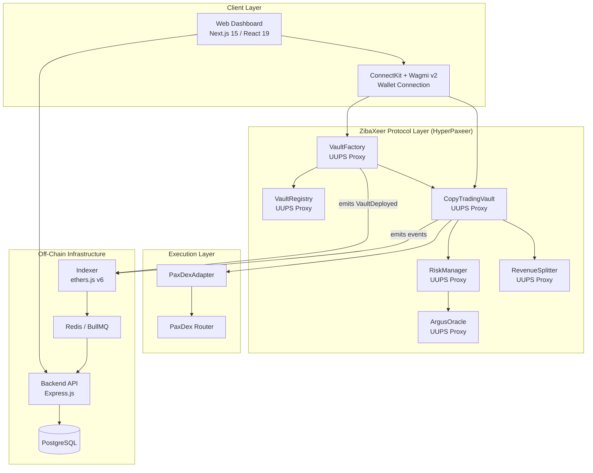
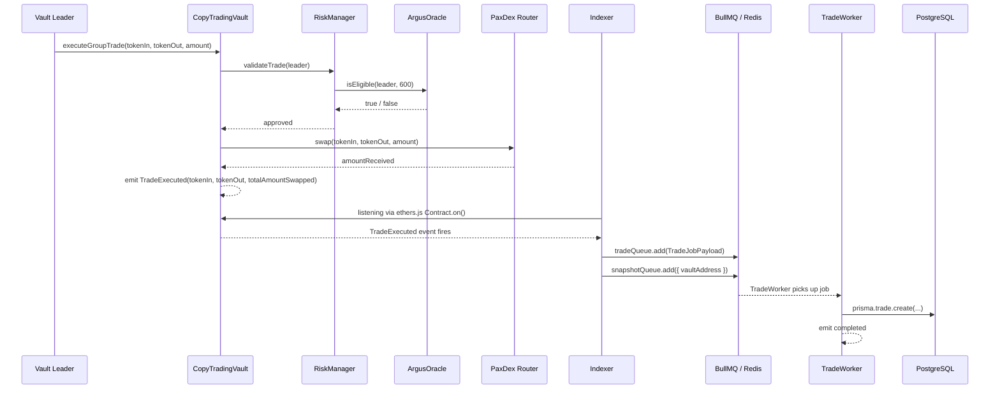
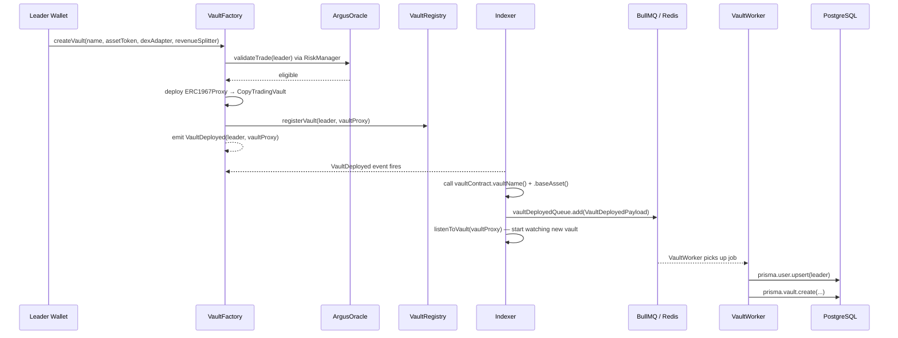
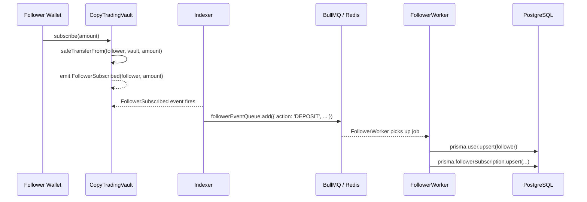
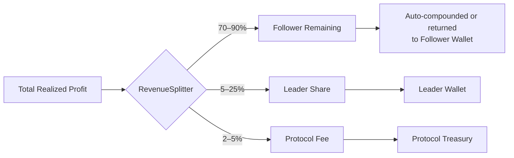
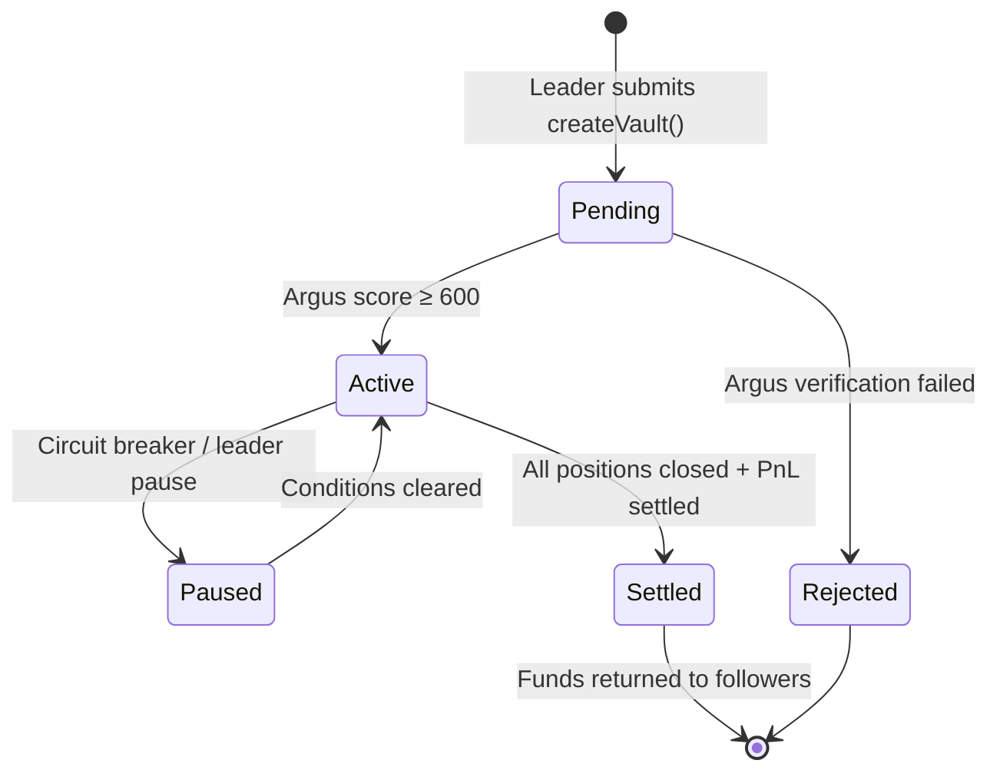
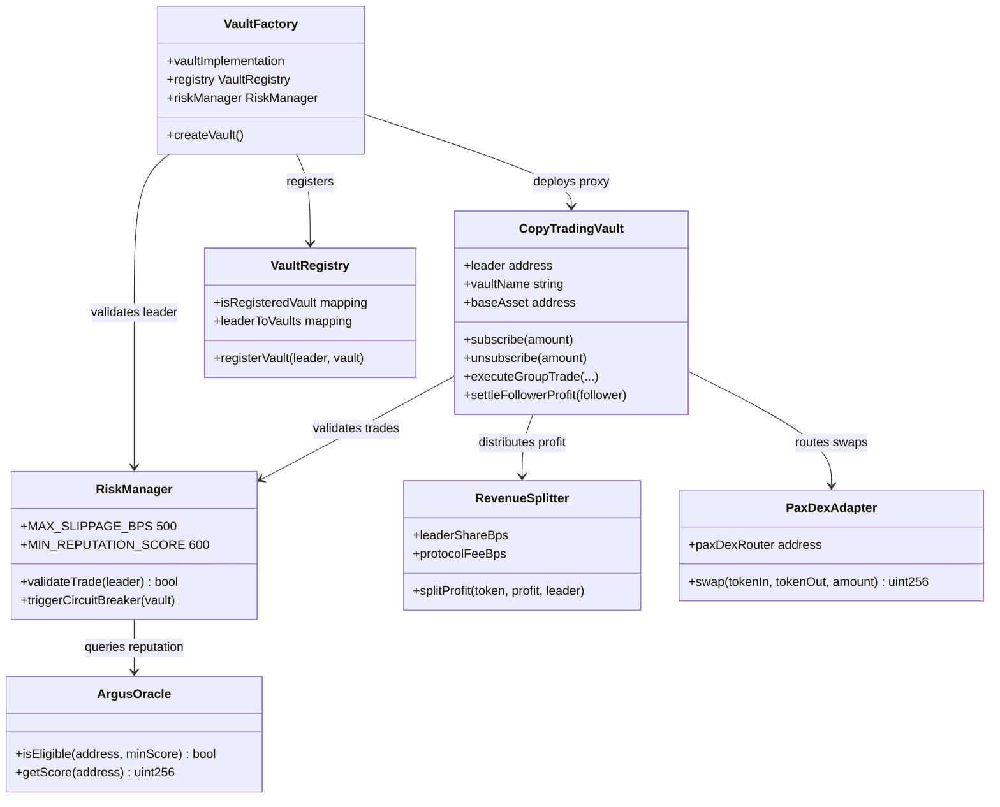

# Architecture

ZibaXeer is a full-stack on-chain protocol. This page covers how every layer connects — from the smart contracts on HyperPaxeer through the off-chain indexer and backend, to the React dashboard.

---

## System Overview



---

## Monorepo Structure

```
ZibaXeer/
├── apps/
│   ├── backend/          # Express.js API + BullMQ workers
│   ├── frontend/         # Next.js 15 dashboard
│   └── indexer/          # ethers.js on-chain event listener
├── contracts/            # Foundry smart contract project
├── packages/
│   ├── db/               # Shared Prisma client + schema
│   ├── sdk/              # Protocol SDK (WIP)
│   ├── types/            # Shared TypeScript types (job payloads)
│   └── utils/            # Shared utility helpers
└── docs/                 # This documentation
```

---

## Trade Execution Flow

The complete sequence from a leader executing a trade to it appearing in the dashboard:



---

## Vault Deployment Flow



---

## Follower Subscription Flow



---

## Revenue Distribution Flow



The split percentages are configurable per vault and stored in `leaderShareBps` and `protocolFeeBps` on the `RevenueSplitter` contract.

---

## Queue Architecture

The indexer produces to four named BullMQ queues. The backend workers consume them.

| Queue | Producer | Consumer | Purpose |
|---|---|---|---|
| `TradeProcessingQueue` | `trade.processor.ts` | `trade.worker.ts` | Persist trade to DB |
| `SnapshotCalculationQueue` | `pnl.processor.ts` | `snapshot.worker.ts` | Recalculate ROI/drawdown |
| `VaultDeployedQueue` | `vaultFactory.listener.ts` | `vault.worker.ts` | Register new vault in DB |
| `FollowerEventQueue` | `vault.listener.ts` | `follower.worker.ts` | Sync follower subscriptions |

---

## Vault Lifecycle



---

## Contract Dependency Map


